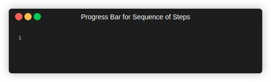

# Progress Indicators for Terminal Output

This module provides various progress indicators for terminal
output and a framework to create new such indicators.

It is possible to combine multiple progress indicators in 
a 'Progress' object. It covers and manages trailing lines of a terminal
output and acts as group to add any number of indicators.
Additionally, indicators can be grouped again. Those groups are
visualized as indicators, also.

The following indicators are directly supported by the library:
- [Simple spinners](#spinner)
- [Progress bars](#progress-bar)
- [Progress bars for estimated remaining time](#progress-bar-for-estimated-total-time) 
- [Step lists](#progress-bar-for-steps)
- [Step lists using indicators to visualize step progress](#nested-steps)
- [Simple text output](#text-output)
- [Text output with leading spinner](#text-output-with-spinner-title-line)
- [Indicator Groups](#indicator-groups)

There are various presets with the visualization of bars and spinners.
Additionally, they can freely be configured.

## Usage

The usage of the library based on the `Progress` type. It is created
using the `For` function for an `io.Writer`, which should represent
a terminal output.

```golang
import "github.com/mandelsoft/ttyprogress"

p := ttyprogress.For(os.Stdout)
```
Progress indicators are defined by progress indicator definition 
objects. For every archetype there is one constructor function providing
a basic configuration.

```golang

bartype := ttyprogress.NewBar()
```

This configuration can be refined by various setters. 

```golang
bartype.SetWidth(ttypprogress.PercentTerminalSize(50))
```

Any such configuration can be used as preconfigured type, which can be
instantiated with `New`. It creates a new configuration based on the given
one, which can be configured independently of the original configuration.

```golang
newtype := ttyprogress.New(bartype)
```

To save a configuration to a new immutable basic type, the function `TypeFor` can be used:

```golang
var BarElapsed = ttyprogress.TypeFor(NewBar(5).SetWidth(50).AppendElapsed())
```

This type is now independent of further modifications of the initial configuration and does not provide methods for further modifications.
But it can be used to create new preconfigured configurations with `New`, again. See the type example in [examples/progress/def](examples/progress/def/main.go).

```golang
newtype := ttyprogress.New(BarElapsed)
```

Any configuration, regardless of its creation method,  can be used to add an arbitrary number of instances
of such a progress indicator to a `Progress` object.

```golang
newtype.Add(p)
```

The indicator is started by calling the `Start` method.
Some indicator archetypes implicitly start the indicator when
some progress is indicated by an appropriate indicator method
like `Incr` on a `Bar` indicator.

Once all indicators are added the `Progress` object can be closed.
It is not possible anymore o add more indicators to a closed group.
With calling the `Wait` method, the calling Go routine waits
until the group and all included indicators are closed.

If a context is given `Wait` also returns if the context is cancelled.

```golang
ctx, _ := context.WithTimeout(context.Background(), time.Minute)
p.Wait(ctx)
```

## Examples

Here some examples for the usage of the various archetypes are shown.

### Spinner

The `Spinner` progress indicator visualizes unlimited progress
by cycling a sequence of fixed sized strings.
The look is completely
configurable, but there are several preconfigured setting.
They can be found in `ttyprogress.SpinnerTypes`. It maps an integer
to a spinner configuration.

```golang
spinner := ttyprogress.NewSpinner().
	         SetPredefined(1000).
			 SetSpeed(1).
			 SetColor(color.New(color.BgGreen, color.Underline)).
			 PrependMessage("working on task ...").
			 AppendElapsed()
```

<p align="center">
  
</p>

This example can be found in [examples/progress/spinner/main.go](examples/progress/spinner/main.go).

### Progress Bar

The `Bar` progress indicator visualizers the progress 
by a fixed length sequence of characters. The look is completely
configurable, but there are several preconfigured setting.
They can be found in `ttyprogress.BarTypes`. It maps an integer
to a bar configuration. For the brackets around the progress sequence
predefined ones can be provided by the map `ttyprogress.BracketTypes`.

The progress is defined an integer value between 0 and a configurable total amount. It can be set absolutely by calling `Set` or incrementally ba calling `Incr`.

```golang
bar := ttyprogress.NewBar().
		SetPredefined(10).
		SetTotal(500).
		SetWidth(ttyprogress.PercentTerminalSize(30)).
		PrependMessage("Downloading...").
		PrependElapsed().AppendCompleted().
		AppendFunc(ttyprogress.Amount(units.Bytes(1024))).
```

<p align="center">
  
</p>

This example can be found in [examples/progress/bar/main.go](examples/progress/bar/main.go).

### Progress Bar for Steps

If there is a fixed set of sequential steps the progress can be indicated with a `Steps` indicator archetype.
It is a `Bar` progress indicator prepared to
indicate the progress of a predefined sequence of steps.

```golang
bar := ttyprogress.NewSteps("downloading", "unpacking", "installing", "verifying").
		PrependStep().
		PrependFunc(ttyprogress.Message("progressbar"), 0).
		PrependElapsed().AppendCompleted()
```

<p align="center">
  
</p>

This example can be found in [examples/progress/steps/main.go](examples/progress/steps/main.go).

### Progress Bar for estimated Total Time.

If there is a time estimation for a progress the `Estimated` archetype can be used. It is a progress bar indicating the progress based on elapsed and total time. Instead of setting the progress, the estimated total time can be updated.

```golang
est := ttyprogress.NewEstimated(10 *time.Second).
		SetWidth(ttyprogress.ReserveTerminalSize(40)).
		SetPredefined(10).
		PrependFunc(ttyprogress.Message("Downloading...")).
		PrependEstimated().
		AppendCompleted().
		AppendElapsed()
```
<p align="center">
  
</p>

This example can be found in [examples/progress/estimated/main.go](examples/progress/estimated/main.go).


### Text Output

The `Text` progress indicator visualizes an output steam.
During the progress it shows a configured number of trailing lines
by providing an `io.Writer`.
After the indicator is closed the complete lines are 
written to the terminal, after all preceding indicators in the group
and all outer groups are also closed.

It is intended to visualize multiple parallel output streams
without mixing the output.

```golang
text := ttyprogress.NewText().
		SetTitleLine("some output").
		SetFollowUpGap("> ").
		SetView(3).
		SetAuto()
```

<p align="center">
  
</p>

This example can be found in [examples/progress/text/main.go](examples/progress/text/main.go).

### Text Output with Spinner Title Line

The `Text` progress indicator visualizes an output steam.
During the progress it shows a configued number of trailing lines
by providing an `io.Writer`, like a [Text](#text-output) indicator.
But instead an optional simple static title line a [Spinner](#spinner)
is used.


```golang
text := ttyprogress.NewTextSpinner().
          SetPredefined(5).
          SetView(3).
          SetFollowUpGap("> ").
	      PrependMessage(fmt.Sprintf("working on task %d...", s+1)).
          AppendElapsed()
```

<p align="center">
  
</p>

This example can be found in [examples/progress/textspinner/main.go](examples/progress/textspinner/main.go).

### Indicator Groups

The initial `Progress` object holds a sequence of progress
indicator. It is an initial indicator group. 
There other `Group` indicators, which act as indicator and can
hold an arbitrary sequence of indicators, again.
The group progress is indicated by another indicator configuration
implementing the adapter API (`GroupProgressElementDefinition`).
So farm this is supported by the `Bar` and `Spinner` archetype.

As long as the groups is not closed more indicators can be
added, even if there are additional indicators in an outer group.
The group indicator is finished, if the group is closed and
all contained indicators are finished.

```golang

func text(g ttyprogress.Group) {
	for t := 0; t < 2; t++ {
		text, _ := ttyprogress.NewTextSpinner().
			SetPredefined(70).
			SetView(3).
			SetSpeed(1).
			SetFollowUpGap("> ").
			PrependFunc(ttyprogress.Message(fmt.Sprintf("working on task %d...", t+1))).
			AppendElapsed().
			Add(g)

		go func() {
			m := 3 + rand.Int()%8
			for i := 0; i <= m; i++ {
				fmt.Fprintf(text, "doing step %d of task %d\n", i+1, t+1)
				time.Sleep(time.Millisecond * 100 * time.Duration(1+rand.Int()%20))
			}
			text.Close()
		}()
	}
}

func main() {
	p := ttyprogress.For(os.Stdout)

	// use spinner to indicate group progress.
	s := ttyprogress.NewSpinner().
		SetSpeed(5).
		SetPredefined(86).
		PrependFunc(ttyprogress.Message(fmt.Sprintf("Grouped work"))).
		AppendElapsed()

	g, _ := ttyprogress.NewGroup[ttyprogress.Spinner](s).
		SetGap("- ").
		SetFollowUpGap("  ").Add(p)
	text(g)
	g.Close()
	p.Close()
	p.Wait(nil)
}
```

<p align="center">
  
</p>

This example can be found in [examples/progress/group/main.go](examples/progress/group/main.go).

### Nested Steps

If the progress of steps for a `Steps` indicator should be visualized
a `NestedSteps` archetype can be used. It is a group controlled
by a `Steps` indicator.
Here, steps are defined by a name and an indicator configuration.
The indicators are added to the group sequentially after the previous
step is finished.

```golang

func Step(n string) ttyprogress.NestedStep {
  return ttyprogress.NewNestedStep[ttyprogress.Bar](
    n, ttyprogress.NewBar().SetTotal(100).
         PrependElapsed().
         AppendCompleted())
}

steps := ttyprogress.NewNestedSteps(
		Step("downloading"),
		Step("unpacking"),
		Step("installing"),
		Step("verifying")).
		SetGap("  ").
		SetWidth(40).
		ShowStepTitle(false).
		PrependFunc(ttyprogress.Message("progressbar"), 0).
		PrependElapsed().
		AppendCompleted()
```

<p align="center">
  
</p>

This example can be found in [examples/progress/nestedsteps/main.go](examples/progress/nestedsteps/main.go).

### Bringing it all together

Using groups complex scenarios can be visualized as shown
in the example  [examples/progress/complex/main.go](examples/progress/complex/main.go).


<p align="center">
  
</p>

### Colors

This library works together with the terminal color library [github.com/mandelsoft/ttycolors](https://github.com/mandelsoft/ttycolors).


<p align="center">
  
</p>

Elements of the main progress line can be colorized separately.

This example can be found in [examples/progress/colors/main.go](examples/progress/group/main.go).

Be careful using colors in text views. This only works, if a line 
contains a complete output format ANSI sequences.


## Acknowledgment of Prior Work

This library is inspired by libraries provided by [Greg Osuri](https://github.com/gosuri): [github.com/gosuri/uilive](https://github.com/gosuri/uilive) and [github.com/gosuri/uiprogress](https://github.com/gosuri/uiprogress) 